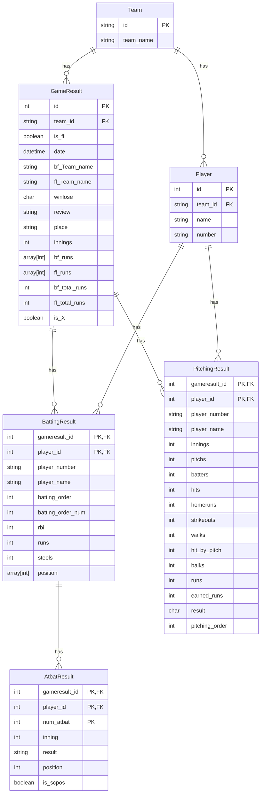

# Yakyusco API's ER Diregram

```mermaid
erDiagram
    Team {
        string id PK
        string team_name
    }
    Player {
        int id PK
        string team_id FK
        string name
        string number
    }
    
    GameResult {
        int id PK
        string team_id FK
        boolean is_ff
        datetime date
        string bf_Team_name
        string ff_Team_name
        char winlose
        string review
        string place
        int innings
        array[int] bf_runs
        array[int] ff_runs
        int bf_total_runs
        int ff_total_runs
        boolean is_X
    }

    BattingResult {
        int gameresult_id PK,FK
        int player_id PK,FK
        string player_number
        string player_name
        int batting_order
        int batting_order_num
        int rbi
        int runs
        int steels
        array[int] position
    }

    PitchingResult {
        int gameresult_id PK,FK
        int player_id PK,FK
        string player_number
        string player_name
        int innings
        int pitchs
        int batters
        int hits
        int homeruns
        int strikeouts
        int walks
        int hit_by_pitch
        int balks
        int runs
        int earned_runs
        char result
        int pitching_order
    }

    AtbatResult {
        int gameresult_id PK,FK
        int player_id PK,FK
        int num_atbat PK
        int inning
        string result
        int position
        boolean is_scpos
    }

    Team ||--o{ Player : "has"
    GameResult ||--o{ BattingResult : has
    GameResult ||--o{ PitchingResult : has

    BattingResult ||--o{ AtbatResult : has

    Player ||--o{ BattingResult : has
    Player ||--o{ PitchingResult : has

    Team ||--o{ GameResult : has

```
